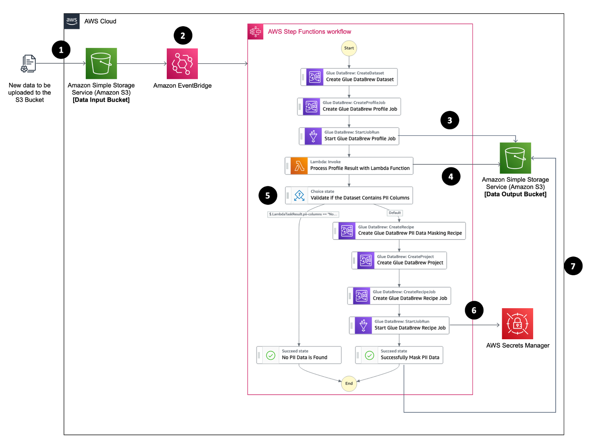
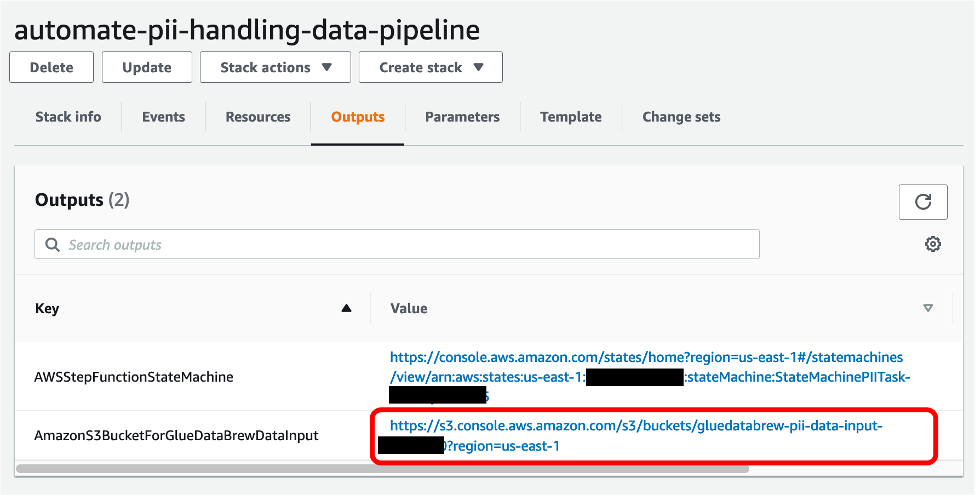
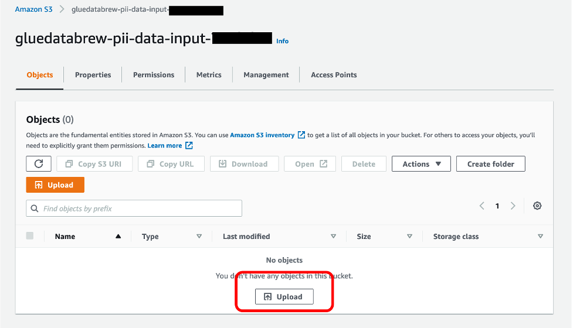
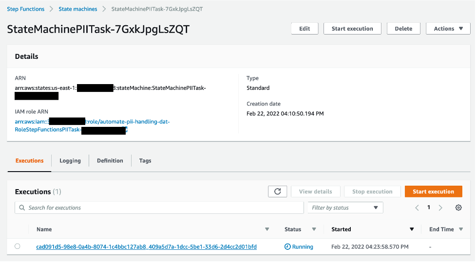
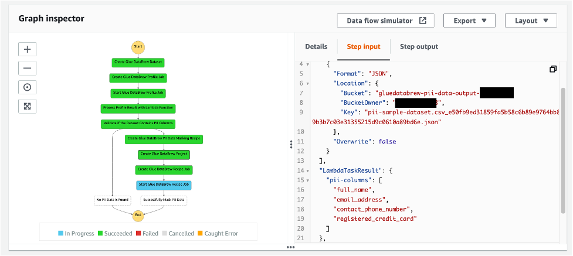
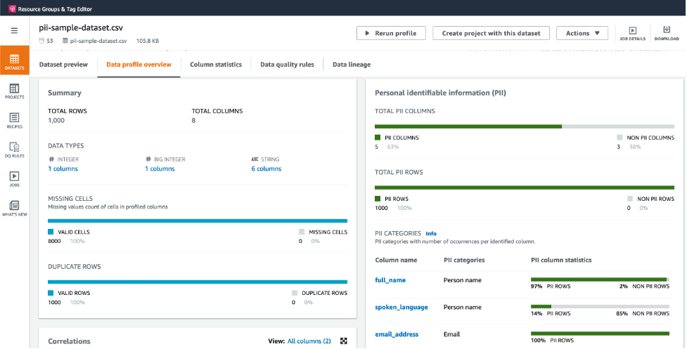
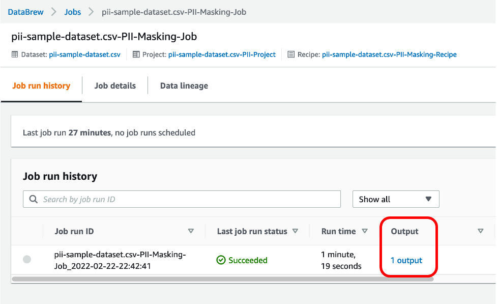
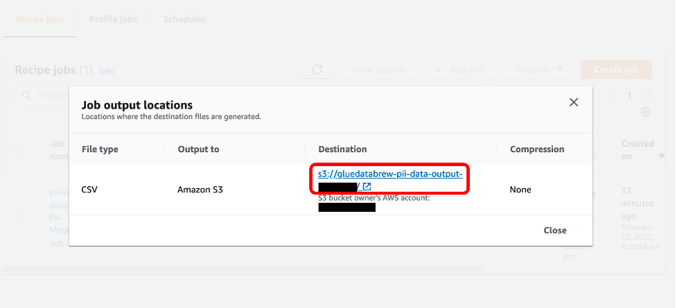
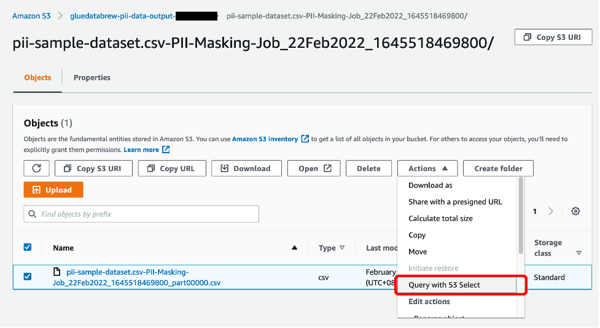
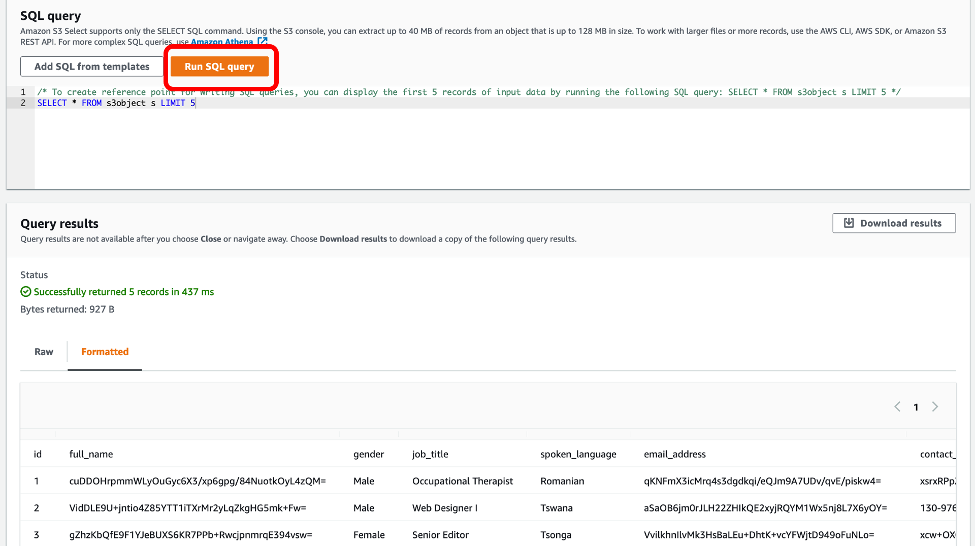

## Automating PII Data Detection and Data Masking Tasks with AWS Glue DataBrew and AWS Step Functions

## Introduction

This repository provides an AWS CloudFormation template that deploys a sample solution demonstrating how to leverage [AWS Glue DataBrew](https://aws.amazon.com/glue/features/databrew/) to automatically detect PII data, and mask the respective PII data with its native transformation functions. The whole workflow can be orchestrated by AWS Step Functions to form an event-driven PII data processing pipeline whenever there is new data landed to Amazon S3.

## Solution Overview

1.	A new data file (you may use the sample synthetic data file [here](https://github.com/aws-samples/automating-pii-data-detection-and-data-masking-tasks-with-aws-glue-databrew-and-aws-step-functions/raw/main/data/pii-sample-dataset.csv) to test the solution generated with [Mockaroo](https://www.mockaroo.com/)) is uploaded to a S3 bucket, which is the data input bucket
2.	EventBridge receives "object created" event from the Amazon S3 bucket, then trigger the Step Functions State Machine
3.	The Step Functions State Machine starts with using Glue DataBrew to register the S3 object as a new Glue DataBrew dataset, and create a profile job. The profile job results including the PII statistics will be written into another S3 bucket, which is the data output bucket
4.	An AWS Lambda function had been developed to read the profile job results and get back with whether the data file contains PII data
5.	If no PII data is found, the workflow will be completed; otherwise, a Glue DataBrew Recipe Job will be further created targeting the columns of data that contain PII data
6.	When running the Glue DataBrew Recipe Job, Glue DataBrew will use the secret (a base64 encoded string, e.g. ‘TXlTZWNyZXQ=’) stored in AWS Secrets Manager to hash the PII columns
7.	After the job is done, the new data file with PII data hashed will be written into the data output

## Deployment on AWS

1.	Sign in to your AWS account
2.	Navigate to one of the AWS regions where AWS Glue DataBrew is available (e.g. us-east-1)
3.	Download the CloudFormation template file [here](https://github.com/aws-samples/automating-pii-data-detection-and-data-masking-tasks-with-aws-glue-databrew-and-aws-step-functions/raw/main/cloudformation-template/AutomatingGlueDataBrewPIIDataDetectionAndMasking.yaml).
4.	Then upload the file in the [CloudFormation create stack page](https://console.aws.amazon.com/cloudformation/home#/stacks/create/template) to deploy the solution.
4.	Provide the CloudFormation stack a stack name or leave the value as default (“automate-pii-handling-data-pipeline”)
5.	Provide a secret (which will be base64 encoded during the CloudFormation stack creation) for the HashingSecretValue parameter used for data hashing
6.	Provide a threshold value (1-100 in terms of percentage, default is 80) for the PIIMatchingThresholdValue parameter to indicate the desired percentage of records Glue DataBrew profile job identified PII data from a given column, so that the data in the column will be further hashed by the subsequent Glue DataBrew PII recipe job
7.	Check the box for acknowledgement at the last step of creating the CloudFormation stack
8.	Click “Create stack” 

## Triggering the Pipeline

After the CloudFormation stack creation is completed, you can find the URL value from the key "AmazonS3BucketForGlueDataBrewDataInput".

Click on the URL value to navigate to the S3 bucket created for Glue DataBrew data input.

To trigger the provisioned data pipeline and test its functionality, you may upload a data file that contains PII data or you may use the sample synthetic data [here](https://github.com/aws-samples/automating-pii-data-detection-and-data-masking-tasks-with-aws-glue-databrew-and-aws-step-functions/raw/main/data/pii-sample-dataset.csv).

Navigate to Step Functions [console](https://console.aws.amazon.com/states/), further click into the state machine with prefix "StateMachinePIITask", you will see there is an execution at "Running" state.

Click into the execution, you can see the progress of the data pipeline through the Graph Inspector.

Once the step "Start Glue DataBrew Profile Job" is completed, you can go to the ["Datasets" section of the Glue DataBrew console](https://console.aws.amazon.com/databrew/home#datasets) to view the data profile result of the dataset you had just uploaded.

From the profile, you will find there are identified columns which contain PII data. While depending on the threshold value you have set when creating the CloudFormation stack, in the default case which is set as 80, the column "spoken_language" in the provided dataset hence would not be included in the PII data masking step since only 14% of the rows had been identified as name of a person.

To inspect the output of the data masking step, go to the ["Jobs" section of the Glue DataBrew console](https://console.aws.amazon.com/databrew/home#jobs?tab=recipe). 

Click on "1 output" of the succeeded recipe job to further see the S3 bucket where the data output is located at.

Click on the value of “Destination” to navigate to the S3 bucket.

Inside the data output S3 bucket, there is a .json file which is the data profile result you have just reviewed in JSON format. There is also a folder path that contains the data output of the PII data masking task. Click into the folder path.

Select the .csv file which is the output of the Glue DataBrew recipe job. Select “Actions”, then click “Query with S3 Select”.

Scroll through the page until you find the “Run SQL query” button. Click on “Run SQL query”.

The query results sampled 5 rows from the data output of Glue DataBrew recipe job that, the columns identified as PII (e.g. full_name, email_address, contact_phone_number) have now been masked.

## Cleaning Up

To avoid incurring future charges, delete the resources.
Navigate to the CloudFormation console and delete the stack named “automate-pii-handling-data-pipeline” (or the stack named with your customized value during the CloudFormation stack creation step).

## Security

See [CONTRIBUTING](CONTRIBUTING.md#security-issue-notifications) for more information.

## License

This library is licensed under the MIT-0 License. See the LICENSE file.

