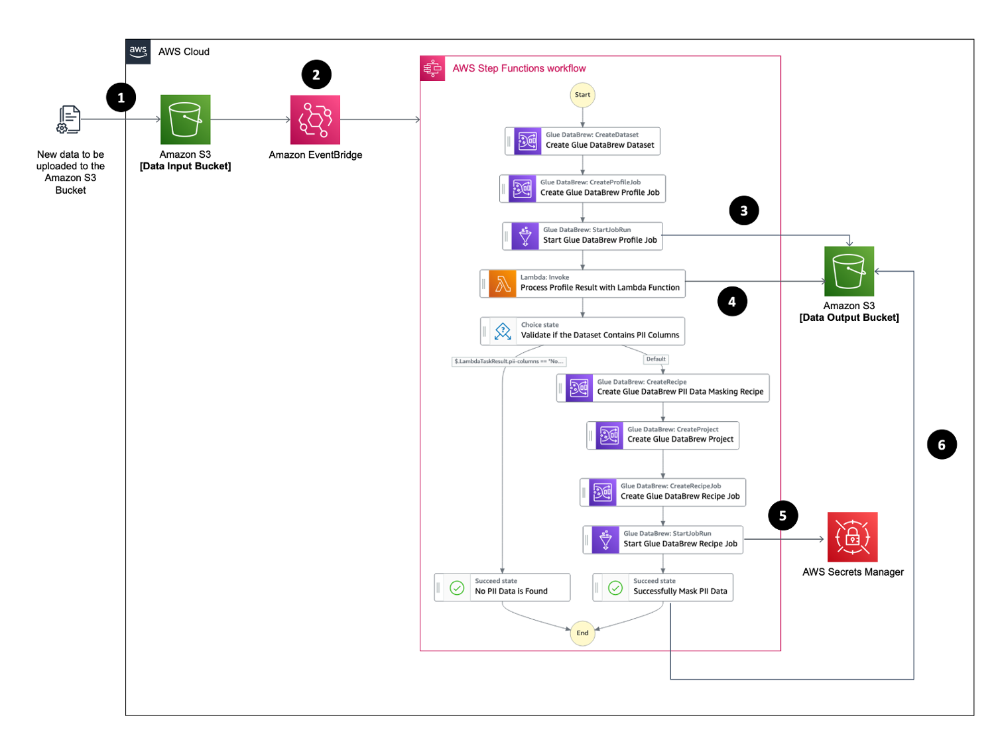

## Automating PII Data Detection and Data Masking Tasks with AWS Glue DataBrew and AWS Step Functions

## Introduction
This repository provides an AWS CloudFormation template that deploys a sample solution demonstrating how to leverage [AWS Glue DataBrew](https://aws.amazon.com/glue/features/databrew/) to automatically detect PII data, and mask the respective PII data with its native transformation functions. The whole workflow can be orchestrated by AWS Step Functions to form an event-driven PII data processing pipeline whenever there is new data landed to Amazon S3.

## Solution Overview

1.	A new data file (you may use the sample synthetic data file [here](https://github.com/aws-samples/automating-pii-data-detection-and-data-masking-tasks-with-aws-glue-databrew-and-aws-step-functions/data/pii-sample-dataset.csv) to test the solution generated with [Mockaroo](https://www.mockaroo.com/)) is uploaded to a S3 bucket, which is the data input bucket
2.	EventBridge receives "object created" event from the S3 bucket, then trigger the Step Functions State Machine
3.	The Step Functions State Machine starts with using Glue DataBrew to register the S3 object as a new Glue DataBrew dataset, and create a profile job. The profile job results including the PII statistics will be written into another S3 bucket, which is the data output bucket
4.	A Lambda function had been developed to read the profile job results and get back with whether the data file contains PII data
5.	If no PII data is found, the workflow will be completed; otherwise, a Glue DataBrew Recipe Job will be further created targeting the columns of data that contain PII data
6.	When running the Glue DataBrew Recipe Job, Glue DataBrew will use the secret (a base64 encoded string, e.g. ‘TXlTZWNyZXQ=’) stored in Secrets Manager to hash the PII columns
7.	After the job is done, the new data file with PII data hashed will be written into the data output

## Deployment on AWS
Download the CloudFormation template file [here](https://github.com/aws-samples/automating-pii-data-detection-and-data-masking-tasks-with-aws-glue-databrew-and-aws-step-functions/cloudformation-template/AutomatingGlueDataBrewPIIDataDetectionAndMasking.yaml). Then upload the file in the [CloudFormation create stack page](https://console.aws.amazon.com/cloudformation/home#/stacks/create/template) to deploy the solution.

## Security

See [CONTRIBUTING](CONTRIBUTING.md#security-issue-notifications) for more information.

## License

This library is licensed under the MIT-0 License. See the LICENSE file.

